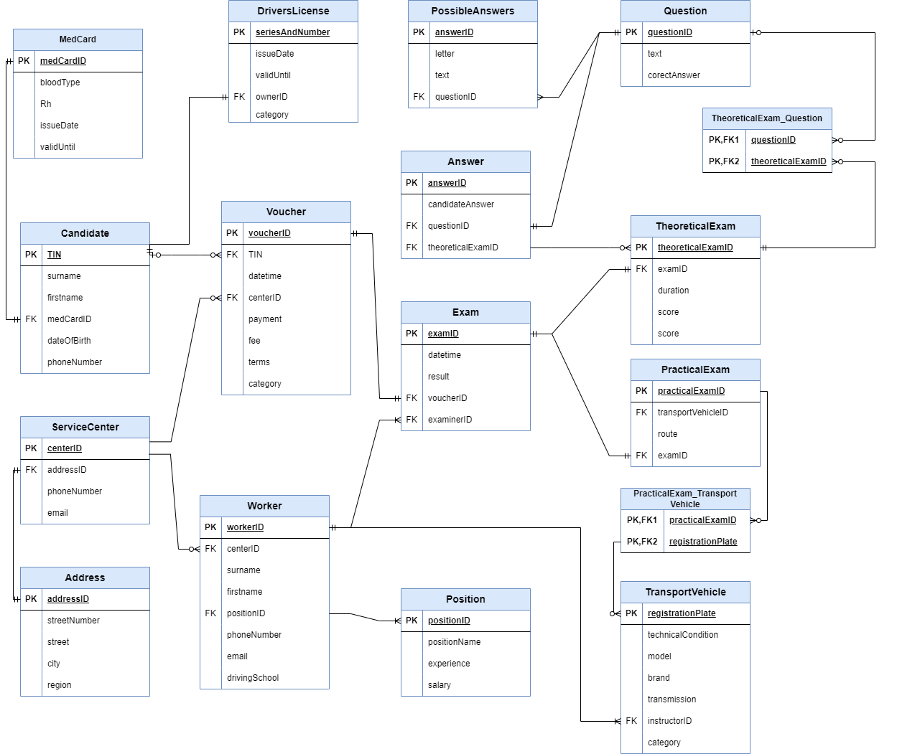

# ServiceCenter Database Coursework

## Database Purpose

This database, named ServiceCenter, is designed to support the activities of a Motor Vehicle Service (MVS) center, specifically in the context of administering exams and managing driver's licenses.

# Database Structure

## ER-model

### Tables

#### Address

Stores information about the addresses, including street number, street, city, and region.

#### ServiceCenter

Contains details about service centers, including phone number, email, and a foreign key referencing the Address table.

#### Position

Holds information about positions within the service center, such as position name, salary, and experience.

#### Worker

Represents workers in the service center, with details like name, contact information, and foreign keys linking to ServiceCenter and Position.

#### MedCard

Stores medical card details, including blood type, Rh factor, issue date, and validity period.

#### Candidate

Contains information about candidates, including name, date of birth, contact details, and a foreign key referencing the MedCard table.

#### Voucher

Manages vouchers for various services, including details like the candidate's TIN, date and time of receiving, service center ID, payment information, and exam details.

#### Exam

Holds details about exams, including date and time, result, examiner ID, and a foreign key referencing the Voucher table.

#### PracticalExam

Stores details about practical exams, including the exam route and a foreign key referencing the Exam table.

#### TransportVehicle

Contains information about transport vehicles used in practical exams, including registration plate, technical condition, model, brand, transmission, and instructor ID.

#### DriversLicense

Manages driver's licenses, including series and number, validity period, issue date, owner ID, and category.

#### PracticalExam_TransportVehicle

Establishes a many-to-many relationship between practical exams and transport vehicles.

#### TheoreticalExam

Stores details about theoretical exams, including duration, score, and a foreign key referencing the Exam table.

#### Question

Contains questions for theoretical exams, including text and correct answers.

#### Answer

Stores candidate answers for theoretical exams, with foreign keys referencing Question and TheoreticalExam tables.

#### PossibleAnswers

Contains possible answers for multiple-choice questions in theoretical exams.

#### TheoreticalExam_Question

Establishes a many-to-many relationship between theoretical exams and questions.

## Constraints and Relationships

Foreign key constraints ensure data integrity and maintain relationships between tables. Check constraints validate data integrity for specific columns, such as salary, experience, and date-related constraints.

## Choosing Microsoft SQL Server for Database Management

Microsoft SQL Server has been chosen as the optimal Database Management System (DBMS) for supporting the operations of the Motor Vehicle Service (MVS) center due to its extensive functionality and security features. The advanced capabilities, seamless integration with Visual Studio, scalability, robust data security measures, and support for modern technologies make SQL Server an effective choice for ensuring reliable and productive database management for the MVS center. Its multi-platform deployment options, including Windows and Linux, further provide flexibility in adapting to diverse environments and technologies.
